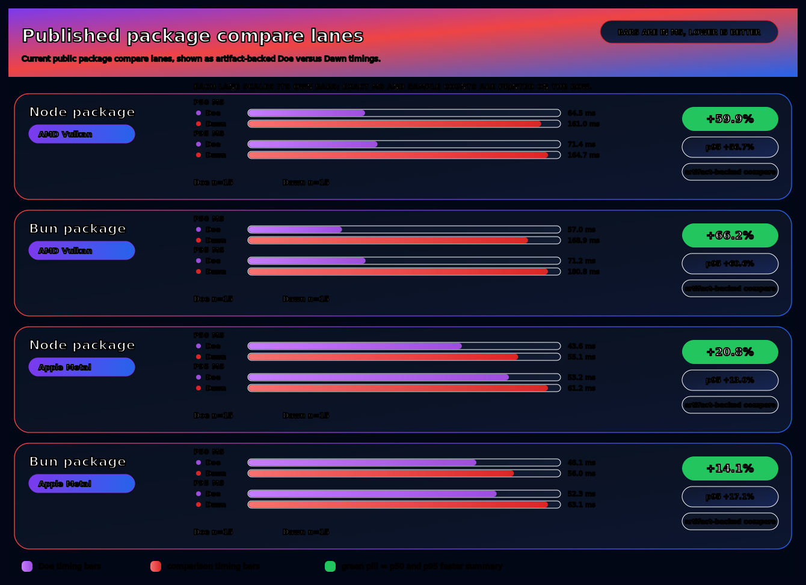
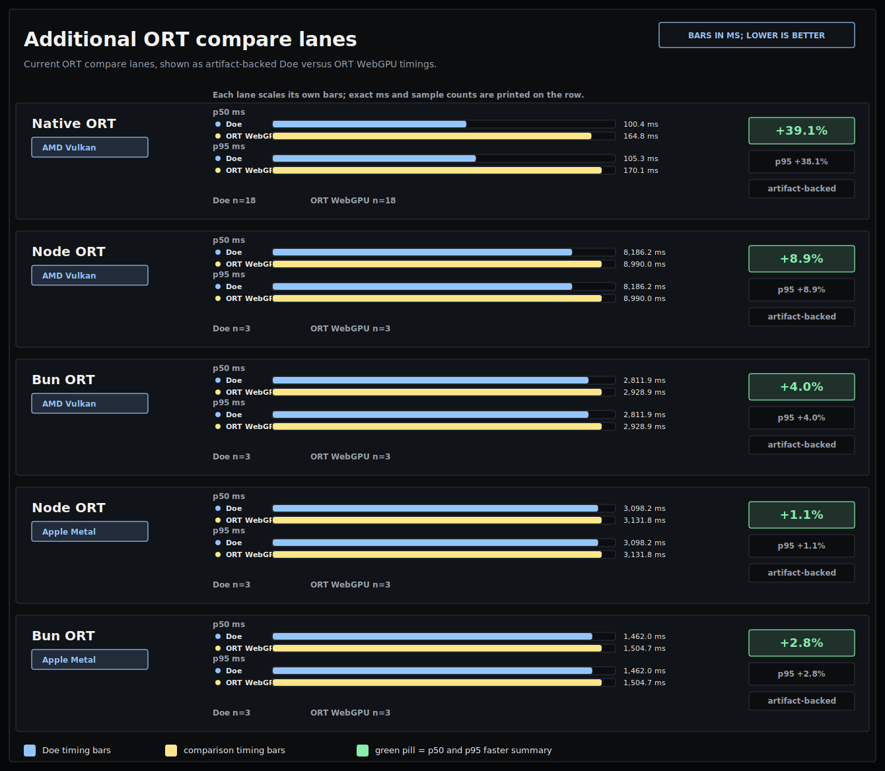

# Doe

<p align="center">
  
</p>

Doe is a source-preserving accelerator runtime and compiler system. It keeps
shader/program bodies visible, lowers them across execution targets, and
produces receipts that prove what ran.

In practice that means embedding where Dawn is too heavy, lowering kernels to
multiple GPU and spatial backends from the same IR, and emitting
artifact-backed receipts that bind every claim to a specific build.

The core roadmap is two-pronged:

- **Chromium-family WebGPU:** make Doe the evidence-backed open-source runtime
  and compiler path that can beat Dawn/Tint without silent fallbacks or broad
  browser-fork drift.
- **Doppler -> Doe -> Cerebras:** consume a closed Doppler Program Bundle,
  lower the same declared WGSL/program identity through TSIR, HostPlan, and
  CSL, and produce parity receipts for simulator and hardware promotion.

These are not separate theses. Both prongs use the same discipline:
source-visible programs, explicit lowering contracts, and receipt-backed
claims.

Published npm surface: [`packages/doe-gpu/README.md`](packages/doe-gpu/README.md).

## Tenants

The repo carries five tenants:

| Tenant | Role |
|---|---|
| Dawn replacement (Zig WebGPU runtime) | runtime tenant; embeddable WebGPU runtime details in [`docs/thesis.md`](docs/thesis.md). |
| Vulkan / Metal / D3D12 emitters | backend tenant; multi-target lowering from the WGSL compiler (`runtime/zig/src/doe_wgsl/`). |
| Cerebras (TSIR / HostPlan / CSL) | spatial retargeting tenant; Tiled Spatial IR plus host-plan and CSL emit (`runtime/zig/src/tsir/`, `runtime/zig/src/doe_wgsl/emit_csl_*`). |
| Lean proof pipeline | verification tenant; proof-eliminated runtime branches and verified artifacts (`pipeline/lean/`). |
| Benchmarks and evidence bundles | proof tenant; claim-discipline gates, parity receipts, hardware-validation bundles (`bench/`). |

Same discipline applied to different targets: shader/program bodies stay
visible, lowering preserves identity, and every claim has a receipt path.

## Why Doe

- Lean runtime: a Zig runtime with a small package layer instead of
  treating Chromium's in-tree Dawn stack as the permanent ceiling.
- Chromium-family target: source-preserving compiler output, explicit
  runtime behavior, and browser-lane receipts into a better WebGPU
  implementation path for Chromium-derived browsers.
- Explicit behavior: no silent fallback, clear runtime boundaries, and
  artifact-backed benchmarking instead of hand-wavy claims.
- Performance work with receipts: current results live in
  [`docs/status.md`](docs/status.md), with public README receipt paths indexed
  in [`reports/claim-index.json`](reports/claim-index.json).

## Current evidence

These charts summarize the current public benchmark lanes. Positive
percentages mean Doe finished faster than Dawn in that lane.



Receipt paths for these charted lanes are listed in
[`reports/claim-index.json`](reports/claim-index.json).

## Additional benchmark outputs

Additional ONNX Runtime (ORT) and compare-lane outputs live in the repo.



Receipt paths for these charted lanes are listed in
[`reports/claim-index.json`](reports/claim-index.json).

## Current product surface

- Strategic runtime target: Chromium-family WebGPU implementation.
- Strategic retargeting target: Doppler-authored model programs lowered to
  Cerebras WSE through receipt-backed TSIR / HostPlan / CSL artifacts.
- Competitive evidence today: native, package, embedded, and server-side
  JavaScript lanes.
- `doe-gpu/browser` is a browser shim over the browser's incumbent WebGPU
  implementation. It does not run Doe runtime code.
- [`browser/chromium/`](browser/chromium/README.md) is the strategic
  Chromium integration lane for replacing Dawn at the `navigator.gpu` seam
  after compatibility, trace, correctness, and comparability gates pass.

## Start here

- Package consumers: [`packages/doe-gpu/README.md`](packages/doe-gpu/README.md)
- Runtime contributors: [`runtime/zig/README.md`](runtime/zig/README.md)
- Benchmarks and evidence: [`bench/README.md`](bench/README.md)
- Current status and claim boundaries: [`docs/status.md`](docs/status.md)
- Chromium WebGPU strategy:
  [`docs/chromium-webgpu-task-list.md`](docs/chromium-webgpu-task-list.md)
- Doppler Program Bundle ingest: [`docs/doppler-ingest.md`](docs/doppler-ingest.md)
- Cerebras lane (Doppler → Doe → Cerebras):
  [`docs/cerebras.md`](docs/cerebras.md). Progress, source, reproduce,
  hardware runbook, rationale.
- TSIR (Tiled Spatial IR) compiler work:
  [`docs/tsir-lowering-plan.md`](docs/tsir-lowering-plan.md),
  [`docs/loop-protocol.md`](docs/loop-protocol.md), live status at
  [`docs/status/tsir.md`](docs/status/tsir.md)
- Project rationale and boundaries: [`docs/thesis.md`](docs/thesis.md),
  [`docs/architecture.md`](docs/architecture.md),
  [`docs/process.md`](docs/process.md)
- Proof and trace pipeline: [`pipeline/lean/README.md`](pipeline/lean/README.md),
  [`pipeline/trace/README.md`](pipeline/trace/README.md),
  [`pipeline/agent/README.md`](pipeline/agent/README.md)

## Quick start

Requirements:

- Zig 0.15.2
- Node.js 18+

```bash
git clone https://github.com/doe-gpu/doe.git
cd doe
zig build dropin
node packages/doe-gpu/scripts/build-addon.js
node packages/doe-gpu/test/smoke/test-smoke-load.js
```

That smoke path checks load and export wiring without requiring a GPU.

## Legacy package names

These legacy package names are deprecated in favor of `doe-gpu`:

- `@simulatte/webgpu`
- `@simulatte/webgpu-doe`

## License

See [`docs/licensing.md`](docs/licensing.md).
