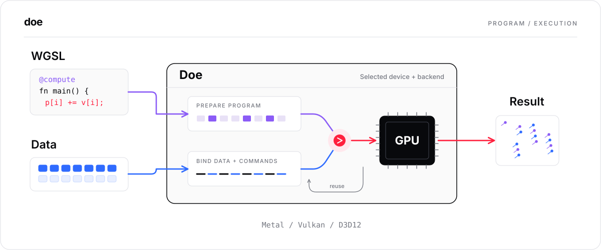

# Doe

Doe compiles WGSL shaders and runs WebGPU applications on native GPU backends.
The compiler and native runtime can earn adoption independently, with separate
evidence. Vulkan is the current engineering focus.

Start with the [ONNX Vulkan evaluation installation](docs/onnx-vulkan-installation.md).
It runs pinned ONNX Runtime WebGPU operators through Doe, with unchanged
SqueezeNet and bounded callback/lifecycle checks. The
[delivery report](reports/releases/20261009-onnx-vulkan-evaluation/README.md) records
local isolated installation and actual Doe execution. The exact archive is now
[publicly downloadable](docs/onnx-vulkan-installation.md#download-the-evaluation)
with commit-pinned URLs and verified checksums. External reproduction, broader
compatibility, retained adoption, and material replacement advantage remain
unestablished. See the guide for host
prerequisites, package acquisition, initialization, cleanup, and exclusions.



Backend support and native/browser releases are qualified separately. See the
[technical diagrams: compiler, execution, resource lifetime](docs/architecture.md#technical-diagrams)
and [support matrix](docs/doe-support-matrix.md).

**[Evaluate ONNX on Vulkan](docs/onnx-vulkan-installation.md)** · [Run your first Doe kernel](#how-to-use-doe)

## Mission, goal, and value

Doe’s product is better compilation and execution for existing local applications: materially
faster operations, lower memory demands, and less CPU overhead through ordinary
WebGPU substitution. [Goals](GOALS.md) and the [strategy](docs/thesis.md) order
ordinary execution, independent framework integration through ONNX Runtime,
and binding application transfer. Browser replacement is an optional, separately
selected route; compiler adoption does not require runtime substitution. The
application-advantage milestone requires material improvement under declared
regression limits, not simultaneous victory in every metric.

The runtime adoption goal is voluntary use by an unchanged external non-Doppler
application for a predeclared measured advantage, followed by retention across
another release or workload. Node/Bun runtime and Fawn/Chromium browser surfaces
retain independent evidence gates. Each must run a named unchanged workload
correctly against a declared incumbent on a declared support matrix. The
receipt, replay artifact, and runtime policy must identify the workload,
provider, physical hardware, backend, and validation result. Browser evidence
does not inherit package claim status, and wrapper evidence does not become
runtime-ownership credit.

Doe serves several audiences:

- Application developers get native GPU execution, explicit resource lifetimes,
  and useful failures under declared numerical requirements.
- Runtime and compiler engineers can inspect lowering, backend selection, and
  generated work.
- Benchmark and release reviewers can trace a claim to its receipt and raw
  artifact.

Doe owns the compiler and runtime implementation. Compiler value includes
compilation latency, diagnostics, supported semantics, and generated-program
performance; runtime value includes memory, resource management, submission,
completion, and integration. Each needs its own evidence. Receipts and
qualification support those claims without becoming the product itself.
Doppler, Dream, Columbo/Valera,
Reploid/Poolday, Cerebras, Chromium/Fawn, and outside projects may provide
workloads, hosts, baselines, or integration surfaces; they do not define Doe’s
runtime claim.

## How to use Doe

Install the public package and run the Node example:

```bash
npm install doe-gpu
node node_modules/doe-gpu/examples/node-first-kernel.mjs
node node_modules/doe-gpu/examples/node-governed-first-kernel.mjs
```

Package entrypoints and public exports are documented in
[`packages/doe-gpu/README.md`](packages/doe-gpu/README.md).
Provider-neutral DoeProof supports both an in-process exact-output callback and
an unchanged Node application executed through the fail-closed `webgpu` loader
with a self-validating process receipt.
The packaged `doe-proof-node` command exposes the same contract to CI with
hash-bound run, verification, inspection, replay, and exact-output comparison.

Contributors making a Doe change should choose one workload and one correctness
or performance question. Change [`runtime/zig/`](runtime/zig/) or
[`packages/doe-gpu/`](packages/doe-gpu/), run the smallest relevant correctness
test, then run the relevant qualified backend checks. Vulkan is the active engineering
focus. Switching to Metal requires explicit prioritization and a handoff; D3D12
remains deferred. These existing backend regression commands do not select
parallel optimization campaigns.

```bash
python3 bench/runners/run_recomposition_backend_evidence.py --backend metal
python3 bench/runners/run_recomposition_backend_evidence.py --backend vulkan
python3 bench/runners/run_recomposition_backend_evidence.py --backend d3d12
```

Inspect the raw receipt and merged classification before updating status.

## Evidence and demonstrated capabilities

Measured results belong to [`reports/claim-index.json`](reports/claim-index.json)
and the artifacts named by its rows. The table records evidence classes; it is
not a universal performance claim.

| Backend | Surface or workload | Comparator | Result | Evidence state | Evidence |
| --- | --- | --- | --- | --- | --- |
| Apple Metal | Native and Node/Bun package lanes | Declared Dawn-backed lanes | Artifact-specific | `claim-indexed` | [`claim index`](reports/claim-index.json) |
| AMD Vulkan | Bun warm application row | Declared Bun WebGPU provider | Artifact-specific | `claim-indexed` | [`claim index`](reports/claim-index.json) |
| AMD Vulkan | Node warm application row | Declared Node WebGPU provider | Artifact-specific | `claim-indexed` | [`claim index`](reports/claim-index.json) |
| AMD Vulkan | Deno warm application row | Deno wgpu | Driver identity incomplete | `diagnostic` | [`claim index`](reports/claim-index.json) |
| AMD Vulkan | Native release rows | Declared Dawn-backed lanes | Artifact-specific | `claim-indexed` | [`claim index`](reports/claim-index.json) |
| AMD Vulkan | Linux drop-in cutover | Dawn rollback lane | Strict cutover rehearsal | `claim-indexed` | [`claim index`](reports/claim-index.json) |
| AMD Vulkan | Pinned HoloScript tropical-SpMV application | I0/I1/W0/D0 ownership matrix | Equivalent exact output and replay; no runtime advantage | `diagnostic` | [`reviewed report`](reports/ecosystem/holoscript-snn-webgpu/holoscript-tropical-spmv-runtime-ownership-2026-08-15-diagnostic.json) |
| AMD Vulkan | Pinned vGPU Node/ORT application | I0/I1/W0/D0 ownership matrix | Equivalent governed lifecycle outcome; no runtime advantage | `diagnostic` | [`reviewed report`](reports/ecosystem/vercel-labs-vgpu/vgpu-runtime-ownership-2026-08-15-diagnostic.json) |
| AMD Vulkan | Pinned wgsl-fns compilation plus semantic application | I0/I1/W0/D0/P0 correction matrix | Doe and bounded wrapper both pass; no runtime advantage | `diagnostic` | [`reviewed report`](reports/ecosystem/wgsl-fns/wgsl-fns-runtime-ownership-2026-08-15-diagnostic.json) |
| AMD Vulkan | Vendored WebGPU CTS subset | CTS required-query subset | Identity-bound subset pass | `diagnostic` | [`CTS receipt`](reports/benchmarks/amd-vulkan/20260810T222323Z/webgpu-cts-subset-receipt.json) |
| AMD Vulkan | Physical recomposition diagnostic | Dawn delegate | Output-oracled capture | `diagnostic` | [`backend evidence`](runtime/zig/reports/recomposition/backend-evidence.json) |
| Intel Tiger Lake Vulkan | Native compute diagnostics | Declared Dawn-backed lane | Host-specific only | `diagnostic` | [`backend status`](docs/status/runtime-backends-and-bench.md) |
| Windows D3D12 | Native runtime | Dawn D3D12 | Evidence incomplete | `scaffolded` | [`support matrix`](docs/doe-support-matrix.md) |
| Fawn/Chromium | Forced-Doe browser lane | Chromium/Dawn | Clean-install release gate remains blocked | `diagnostic` | [`clean-install receipt`](browser/chromium/artifacts/20260811T130500Z/fawn-release-clean-install.diagnostic.json) |

The latest physical backend bundle is
[`backend-evidence.json`](runtime/zig/reports/recomposition/backend-evidence.json).
Read the claim index and sidecars before repeating a result.

## Long-term value

Earn retained use through better compilation and execution across applications
and qualified hardware. Independently installable compiler and runtime surfaces,
clear interfaces, and maintained integration should make that value accessible.
Receipts, replay, and qualification help diagnose failures and assess releases;
ordinary execution does not require detailed tracing or artifact publication.

## Retained experimental integrations

[Fawn's particle demo](https://canvascontext.com/) uses the browser's WebGPU
implementation. Ordinary Chrome runs its own provider; loading `doe-gpu/browser`
does not install Doe. The retained Fawn/Chromium integration remains diagnostic
and deferred until an explicit selection decision and separate browser acceptance.
Closed browser optimizer experiments remain closed; a new compiler opportunity
needs its own consumer and acceptance rather than automatically reopening them.

## Limits and current status

Receipts, replay, deterministic artifacts, and runtime policy identify and
reproduce execution. They do not establish a general speed advantage without a
matched workload and timing scope. One Metal or Vulkan capture does not support
a universal Doe performance claim. D3D12 has no physical capture in the current
status table, and Chromium remains diagnostic.

## Repository map

- [`packages/doe-gpu/`](packages/doe-gpu/) — public npm package
- [`runtime/zig/`](runtime/zig/) — native runtime, compiler, and backends
- [`bench/`](bench/) — correctness, compatibility, performance, and claim tools
- [`config/`](config/) — schemas and machine-owned policy
- [`browser/chromium/`](browser/chromium/) — Chromium integration contracts and diagnostics
- [`pipeline/`](pipeline/) — trace, upstream intelligence, and proof tooling
- [`docs/`](docs/) — architecture, process, support, and status documentation

## Read next

- [Repository goals](GOALS.md)
- [Component authority index](docs/component-index.md)
- [Product strategy](docs/thesis.md)
- [Architecture](docs/architecture.md)
- [WebGPU implementation peers](docs/implementation-peers.md)
- [Process and release law](docs/process.md)
- [Support matrix](docs/doe-support-matrix.md)
- [Current status](docs/status.md)
- [Documentation index](docs/INDEX.md)

The governing order is `Mine -> Normalize -> Verify -> Bind -> Gate ->
Benchmark -> Release`, defined in [`docs/process.md`](docs/process.md).

## License

[MIT License](LICENSE)
