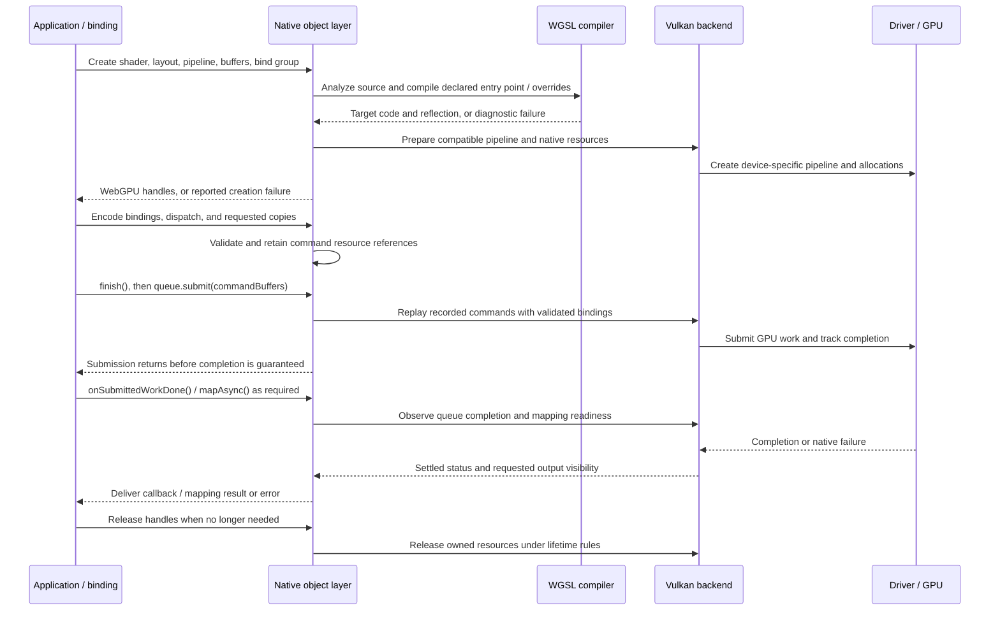

# Doe architecture

## Technical diagrams

These views trace source at `49f6e0af0`: compiler ownership, native execution,
and optional prepared-program lifetimes. They explain implementation boundaries;
they do not extend the [qualified support matrix](doe-support-matrix.md).
The README contains component and lifetime diagrams. This guide includes the
submission sequence, source boundaries and execution contracts.

### Compiler and runtime ownership

[View this diagram in the README.](../README.md#compiler-and-runtime-ownership)

Arrows represent calls or data flow, not unrestricted imports. The compiler can
return target code without opening a Doe device. Native execution selects a
backend rather than cascading through hidden fallback providers. Emission and
backend implementation do not by themselves establish platform qualification.
Vulkan is the active engineering focus; other targets retain their own scope.

The browser wrapper uses the browser's existing WebGPU provider. It does not
install this native runtime into ordinary Chrome. Browser compiler use and the
experimental Fawn runtime integration are separate entry points. DoeProof and
offline improvement tooling are outside the ordinary execution path.

| Boundary | Implementation |
| --- | --- |
| JavaScript native provider | [native.js](../packages/doe-gpu/src/native.js), [vendor WebGPU bindings](../packages/doe-gpu/src/vendor/webgpu/) |
| Native objects and command recording | [native API exports](../runtime/zig/src/native/api/), [doe_command_recording.zig](../runtime/zig/src/native/command/doe_command_recording.zig) |
| Parse, type, and transform | [analysis.zig](../runtime/zig/src/compiler/wgsl/pipeline/analysis.zig) |
| Target lowering | [translate_spirv.zig](../runtime/zig/src/compiler/wgsl/pipeline/translate_spirv.zig), [compiler architecture](shader-compiler-architecture.md) |
| Backend-private execution | [backend implementations](../runtime/zig/src/backend/), [shared contracts](../runtime/zig/src/contracts/) |

### Native compute submission and completion

This follows ordinary native WebGPU compute through the Vulkan submission
adapter. Host bindings translate the API calls; they do not interpret WGSL or
implement the kernel's arithmetic.

Recording, submission, completion, and readable output are distinct boundaries.
Command references retain their dependencies. A caller's timeout does not prove
GPU completion or authorize early reuse. Device loss and submission failures
must reach the caller; this sequence's successful path is not a claim that every
failure or backend has passed physical acceptance.

Source owners: [command references](../runtime/zig/src/native/command/doe_command_references.zig),
[queue dispatch](../runtime/zig/src/native/queue/doe_queue_submit_native.zig),
[Vulkan command submission](../runtime/zig/src/native/queue/doe_queue_submit_vulkan.zig),
and [queue lifecycle](../runtime/zig/src/native/queue/doe_queue_lifecycle.zig).

### Optional prepared-program resource lifetime

`doe-gpu/compute-program` adds explicit reuse for fixed-shape buffer computation.
Ordinary WebGPU does not require it. The diagram separates the immutable
description, prepared resources, each invocation, and structural replacement.

[View this diagram in the README.](../README.md#optional-prepared-program-resource-lifetime)

The selectable modes are `webgpu`, `native-recorded`, and the supported Vulkan
`gpu-recorded` path. A missing provider or incompatible native contract is an
error, not permission to switch modes silently. Hashes identify candidates;
compatible resource declarations and device ownership govern actual reuse.
Resident-state resets in the strict update contract require approval bound to
the assessed edit. Cancellation does not interrupt already submitted GPU work.
Failures after submission can invalidate the program rather than make its
resident state available for another successful run.

[compute-program.js](../packages/doe-gpu/src/compute-program.js) owns preparation,
invocation, update, and close; [completion](../packages/doe-gpu/src/compute-program-completion.js)
settles both queue and mapping promises; [residency](../packages/doe-gpu/src/compute-program-residency.js)
owns resource leases; [update authorization](../packages/doe-gpu/src/compute-program-update.js)
binds reset approval. The [reusable-program contract](reusable-compute-programs.md)
defines supported shapes and mode limits.

## System surfaces

Doe develops an independently usable WGSL compiler and native WebGPU runtime.
Either can earn adoption without requiring the other; their contributions need
separate evidence. The current native integration front door is the
[ONNX Vulkan evaluation package](onnx-vulkan-installation.md), with bounded
[execution and installation evidence](../reports/releases/20261009-onnx-vulkan-evaluation/README.md).
Vulkan is the active engineering focus; optional integrations and qualification
tooling support compilation and execution.

1. `runtime/zig`
   The core Doe runtime: WGSL pipeline, backend execution, runtime artifacts,
   and shared-library outputs.
2. `packages/doe-gpu`
   The JavaScript package surface for Node.js, Bun, Deno, and browser-facing
   wrappers.
3. `browser/chromium`
   The experimental Fawn/Chromium distribution lane: integration contracts, release
   packaging, clean-install verification, browser probes, and evidence gates.
4. `bench`
   Compare harnesses, gates, and evidence workflows.
5. `pipeline/*` plus `config/*`
   Quirk mining, proof artifacts, trace/replay contracts, schemas, and policy.

These surfaces are related, but they are not interchangeable.

They also sit at different maturity levels. Dawn remains the WebGPU runtime
used in Chromium and much of the browser ecosystem. Doe's native/package lane
has physical evidence; Fawn is an experimental distribution target whose
current browser evidence remains diagnostic.

## Strategic decomposition

Doe owns independently adoptable compiler and runtime surfaces. Controlled
package/native hosts provide the compatibility entry; explicitly declared repeated programs expose
work that can be prepared and retained. The decomposition is:

1. **Program identity preservation**
   Source-preserving execution and multi-backend lowering are the same concern:
   preserving source/program identity from input through every lowered artifact
   and execution receipt. WGSL, Doe IR, TSIR, HostPlan, CSL, MSL, SPIR-V,
   DXIL/HLSL, command graphs, and trace receipts must stay linked by explicit
   hashes and contracts.
2. **Independent native runtime surface**
   The native WebGPU runtime path remains its own product surface:
   `doe-zig-runtime`, `libwebgpu_doe`, the JavaScript package bindings, and
   native/drop-in lanes. Chromium integration should prove this runtime in a
   browser process model; it should not collapse the runtime product into a
   browser fork.
3. **Evidence and trust discipline**
   Receipt-backed claims and compiler/proof discipline are one trust system.
   A claim against Tint, Dawn, or Chromium is valid only when the relevant
   compiler evidence, runtime trace, browser diagnostic, proof artifact, or
   benchmark report satisfies the gate for that surface.

The shared execution unit for that trust system is a correctness-bearing
workload. Pure transforms, native runtimes, browsers, and comparisons are
executor adapters beneath one contract. The core ledger stays executor-neutral
and binds specialized evidence through typed extensions; see
[`workload-system.md`](workload-system.md).

## Architectural law: Hexagonal inside, vertically integrated outside

1. **Inside the Zig Runtime:** Decoupled, contract-governed, and acyclic
   (`src/contracts/` -> `src/backend/ports/` -> `src/app/` -> leaf backends).
   No browser-specific globals, no direct cross-backend imports.
2. **Outside the Zig Runtime:** Applications select `DoeRuntime` through the
   package or native embedding. `DoeLab` supplies correction workflows and
   `DoeProof` evaluates execution. Compiler users may adopt WGSL processing and
   target lowering independently. Browser replacement is optional and deferred,
   requiring explicit selection, native wins, transfer, and separate qualification.
3. **Cross-Layer Optimization:** Governed through explicit contracts
   (`WorkloadProfile`, `SpecializationPolicy`, `PromotionReceipt`), never
   through hidden runtime heuristics or implicit environment checks.

## Product boundary rules

The important boundary distinctions are:

- `runtime/zig` is the real runtime implementation
- `runtime/bridge/onnxruntime-ep` retains a historical repo-only plugin experiment and routes to the qualified existing-provider ONNX Vulkan integration
- `doe-gpu` is the package surface over that runtime
- `doe-gpu/browser` is a browser wrapper, not the Doe runtime running inside the browser
- `browser/chromium` owns the experimental Fawn browser-runtime integration
- `bench` owns evaluation tooling; its explicitly public ONNX evaluation distribution packages the supported integration without transferring runtime ownership

Current scope:

- Dawn is the comparison baseline
- Doe runs in Node.js, Bun, Deno, drop-in, and embedded/native lanes
- pinned ONNX Runtime WebGPU operators execute through Doe's explicit proc-table integration; local installation and bounded lifecycle evidence are established
- material ONNX replacement advantage, broader compatibility, external reproduction, and retained adoption remain unestablished
- browser `navigator.gpu` replacement is an optional, separately selected route; Fawn and browser optimization remain deferred

That separation is deliberate. It keeps package ergonomics, runtime behavior,
and browser integration from getting blurred together in docs or benchmarks.

## Core module flow

At a high level, Doe works like this:

1. `pipeline/upstream_intelligence` and `pipeline/agent`
   Preserve versioned Gerrit and issue evidence, produce constrained review
   packets, and independently mine checked-out source for quirk/workaround
   signals.
2. `config`
   Holds schemas, policies, workload contracts, and versioned control data.
3. `pipeline/lean`
   Formalizes selected obligations and emits proof artifacts when enabled.
4. `runtime/zig`
   Consumes config and optional proof artifacts, then executes the runtime on
   Metal, Vulkan, or D3D12.
5. `bench` and `pipeline/trace`
   Verify correctness, comparability, replayability, and claimability from
   emitted artifacts.

The current Lean theorem inventory is recorded in
`pipeline/lean/artifacts/proven-conditions.json`; architecture docs should
refer to that artifact rather than restating counts.

## Execution model

### Semantic and execution owners

These are implementation obligations, not a declaration that every path has
already passed its review or physical qualification.

| Owner | Responsibility |
| --- | --- |
| `packages/doe-gpu/` and native adapters | Host values, public interfaces, callbacks, and error delivery |
| `runtime/zig/src/contracts/` | Shared command, resource, format, identity, and result meanings |
| `runtime/zig/src/compiler/wgsl/` | Parsing, semantic validation, IR, transformations, and target shader emission |
| `runtime/zig/src/native/` | WebGPU objects, API validation, references, and command ownership |
| `runtime/zig/src/backend/` | Backend-private state, pipelines, recording, synchronization, submission, completion, and destruction |
| `bench/` and supporting tooling | Independent evaluation and offline improvement proposals |

Platform APIs and drivers still perform subsequent compilation and hardware
execution. Host adapters must not implement a second interpretation of WGSL.
Ordinary WebGPU, command-oriented execution, and prepared package programs
remain distinct entrypoints sharing applicable semantics. A universal command
interpreter is not required for architectural symmetry.

### Reuse and completion obligations

Keep immutable descriptions, device-specific prepared resources, and invocation
inputs/completion separately owned. Reuse binds exact shader bytes, entrypoint,
layout, effective compiler options and compiler identity, and device identity.
Hashes locate candidates; complete identity checks authorize reuse. Native
allocation generations distinguish replacement allocations from recycled handles.

Compatible parameter updates may reuse resources. Structural changes prepare a
replacement before activation; failure preserves the working program.
Incompatible resident-state changes require explicit application approval.
The public fixed-shape buffer-compute contract and distinct `webgpu`,
`native-recorded`, and Vulkan `gpu-recorded` modes remain bounded by
[reusable compute programs](reusable-compute-programs.md).

Submission transfers lifetime obligations. Timeout means waiting stopped, not
that GPU use ended. Unknown completion retains ownership and blocks unsafe
reuse or destruction. Terminal failure still requires cleanup and error delivery;
it never authorizes successful outputs or valid execution claims.

### Enforcement and observation obligations

Use Zig compile-time checks, exhaustive decisions, and type inspection to reject
missing command decisions, incomplete adapters, and unsupported snapshot shapes.
Generate immutable build choices from authoritative definitions, resolve hardware
facts per device, and validate changing resources per invocation. Application
WGSL received later still needs compilation. Follow
[the Zig style guide](../runtime/zig/STYLE.md) for explicit allocators, checked
arithmetic, acquisition rollback, cache bounds, and backend-private ownership.
Structural checks do not prove ownership or semantic correctness; specialization
needs runtime, binary-size, and build-cost evidence.

Diagnostics report the best established source location, validation rule,
resource, command, submission, or native error. Unattributed hardware faults
must not acquire invented WGSL locations. Detailed tracing is optional and
artifact writing stays outside ordinary execution. Keep CPU work, allocations,
retained capacity, transfers, application latency, and available GPU observations
separate; requested GPU bytes are not residency.

Agents propose improvements offline against frozen tests and independent
comparisons. Application requests execute selected versions without silently
rewriting their compiler, runtime, or policy. Ordinary execution remains useful
without the development system. Numerical correctness uses independent exact
outputs where justified and declared tolerances elsewhere; artifact identity
alone does not establish numerical agreement.

### Existing execution contracts

Command ingestion takes stable identity and canonical names from
`contracts/command.zig`. Parsing and payload cleanup switch exhaustively over
that contract. Compile-time alias checks reject missing owners and ambiguous
spellings; allocation and lifetime tests remain independent evidence. The
native WebGPU object API retains its own narrow adapters.

Operation accounting also belongs to command metadata. Every command declares
a single operation or a payload count, with the existing minimum-one
normalization. Compilation checks that a selected count field exists and is
`u32`, and that dynamic async capability selection belongs to the async
diagnostics command. Execution receipts and independent validation still decide
whether work ran; an accounting count is not proof of dispatch or completion.

Internal Zig migration: `Metadata` initializers now require `operation_count`;
the contract declares `single`, `repeat`, `draw_count`, or `iterations` explicitly.
No serialized command, trace, or requirements field changes, and existing command
counts and capability sets retain their meaning. Compile-time structural checks
do not prove that a declared accounting rule is semantically correct.

The [source-layout manifest](../runtime/zig/source-layout.json) owns module
responsibilities and dependency permissions; its [generated source map](../runtime/zig/src/README.md)
is the navigation surface. The [application contexts](thesis.md#application-and-partner-contexts)
exercise these owners rather than defining separate product subsystems. An
image-processing integration supplies shaders, declared work, and acceptance
tests; image-editor policy does not belong in resource management.

The optional `doe-gpu/compute-program` contract binds inline WGSL, fixed buffer
sizes and roles, ordered dispatches, and a readback output. Preparation retains
private allocations, shaders, pipelines, and bindings. Explicit `gpu-recorded`
execution owns compiled Vulkan commands and their pipeline and descriptor
lifetimes. `native-recorded` retains host commands and replays them through Zig;
`webgpu` retains resources and encodes each invocation as an explicit control.
GPU recordings validate native buffer identities before submission and own
private descriptor state. A device-local registry shares live Vulkan compute
pipelines after checking SPIR-V, entry point, descriptor layout, and effective
subgroup requirements. References outlive ordinary cache replacement and release
the pipeline when the last state closes.

Invocation-local buffers use input snapshots and scratch/output clears.
Explicit program-lifetime buffers retain state between invocations.
An atomic update shares only resources with identical declaration keys, records
the replacement plan, and closes the old program after successful preparation.
Source, shape, resource changes, and device loss therefore cannot silently reuse
stale command assumptions. See [`reusable-compute-programs.md`](reusable-compute-programs.md).

Keep immutable program descriptions, device-specific prepared resources, and
mutable invocation state distinct. A borrowed `PreparedOperation` is valid only
within its synchronous execution and callback scope. Deferred use owns an
`OwnedPreparedOperation` snapshot. CPU scope exit cannot establish GPU
completion: command recording, submission, completion, and final resource
release must each preserve the owner's lifetime obligations. Updates prepare
replacement state before publishing it, and failure preserves the old owner.
Snapshot cloning preserves slice alignment and sentinels and rejects typed data
pointers without an ownership rule. Opaque handles and callback addresses remain
externally owned identities; copying them does not extend a resource lifetime.
The registered snapshot tests cover source-owner release and partial-allocation
rollback. This is structural coverage and lifetime testing, not general ownership
proof or protection against copying an owning Zig struct.

Compatibility adapters translate host values, C layouts, callbacks, and errors
at explicit interfaces. They consume native ownership rules and expose the
cost and lifetime of host copies. Compiler transformations preserve source
locations and operation identity; diagnostics belong to the compilation that
produced them. Neither evidence collection nor workaround selection may become
a competing execution implementation.

The native instance owns callback obligations and unique issued future identities.
Producers publish readiness; requested callback modes determine whether matching
WaitAny, the owning ProcessEvents pump, or a spontaneous producer/worker may deliver.
Callbacks run outside the owner mutex with retained payload/resource leases. Request
cleanup precedes settlement, and active wait/pump calls retain their instance through
reentrant caller releases. The process-wide work-done registry remains for legacy
calls without an instance. Callback userdata stays caller-owned through delivery;
callback readiness does not substitute for native GPU completion. See the
[bounded callback contract](native-callback-contract.md) for the qualified Vulkan
paths and the [device lifecycle successor](native-device-lifecycle-contract.md).
Application device references and internal cleanup leases are distinct. Explicit
destruction and last external release invalidate GPU admission; an instance-owned
loss event borrows a scoped device lease only during delivery. Abandonment and real
driver loss remain separately qualified boundaries.

Resolve build configuration, device discovery, and invocation-dependent checks
at their respective lifetimes. Toggle classifications are compiled from the
versioned registry into immutable storage; physical GPU and driver matching
remain runtime inputs. Device allocators, queues, caches, and resource identities
retain device ownership. Future bounded scheduling belongs above those devices,
with explicit transfers. Browser and application-engine adapters supply host
requirements without adding browser or widget policy to shared GPU contracts.

The [command-storage example](command-storage-development.md) connects a typed
build policy to the existing pool and derived diagnostic metadata. Observation
stays in native ownership paths; calibration and candidate decisions stay in
benchmark tooling. This does not unify the native object API with the separate
prepared-operation executor or impose an evaluator on runtime users.

The active journeys reuse the existing package qualification, declared-program
applications, and compiler regressions. Their accepted behavior, physical
support, failure cases, and measurements stay with those executable workloads.
Pure-logic and allocation-failure tests complement retained-binary tests across
mapping, callbacks, submission, cancellation, and cleanup. Structural changes
preserve behavior; arithmetic or synchronization changes require separately
identified acceptance evidence.

Doe is designed around explicit runtime behavior:

- backend selection is policy/config driven
- strict lanes do not silently fallback
- unsupported capabilities fail with typed, actionable errors
- hot-path behavior stays in Zig unless it can be hoisted out by proof/config

Current native backend identities are:

- `doe_metal`
- `doe_vulkan`
- `doe_d3d12`
- `dawn_delegate` as the Dawn-comparison lane

## Verification boundary

Doe supports two broad modes:

1. Ahead-of-time verified execution
   Selected invariants are proven offline and used to remove runtime work.
2. Runtime-checked execution
   Zig keeps the necessary dynamic checks for untrusted inputs.

The design rule is:

1. implement deterministic behavior in Zig first
2. measure it
3. move conditions into proof/config only when that lets Doe delete runtime
   branches safely

## Browser lane split

There are two distinct browser-related paths:

1. `packages/doe-gpu/browser`
   A JS shim that forwards to the browser's own WebGPU objects. No Doe Zig
   runtime executes there.
2. `browser/chromium`
   The Track A lane that aims to make browser `navigator.gpu` run on Doe
   instead of Dawn.

Those paths answer different questions and should not be described as the same
thing.

They also sit at different maturity levels. The browser shim is a present
compatibility surface. Fawn/Chromium is a retained experimental integration,
deferred until explicitly selected. Its evidence remains diagnostic until a
complete archive passes isolated clean install,
forced-provider identity, an unchanged application oracle, and lifecycle gates.

## Build and evidence outputs

A useful Doe build/run can emit:

- runtime artifact(s)
- run metadata
- trace or trace-meta artifacts
- a self-checking source-to-IR-to-backend execution identity receipt
- benchmark reports
- optional proof artifacts and hashes

The artifact chain matters as much as the code. Doe treats claims as valid only
when they are tied back to those emitted contracts.

Native package release candidates use a self-contained custody boundary. The
candidate report, its runtime-specific reliability report, and the exact
wrapper and platform tarballs share one bundle directory. Tracked
implementation references resolve against the declared clean Git commit;
shipped manifests, first-kernel entrypoints, addons, build metadata, and native
library hashes resolve from the retained tarballs. `bench` independently joins
the three Node, Bun, and Electron receipts before package-candidate admission.
Schema-version-1 reports that bind hashes without retaining the bytes remain
diagnostic history and cannot cross this boundary.

For native Vulkan, the execution-identity receipt composes the runtime's shader
artifact manifest with trace metadata and the workload oracle. It verifies the
exact WGSL, semantic state, IR, SPIR-V bytes, manifest identity, backend lane,
no-fallback state, dispatch count, and output digest. This is stronger than the
public JavaScript observer because it reaches the runtime-owned lowering
artifact; it remains narrower than driver- or operating-system-level tracing.

Package applications can opt into a separate native Vulkan identity journal
with `DOE_PROGRAM_IDENTITY_TRACE_PATH`. The public observer records the
application-visible source, command shape, synchronization, readback, and
output. The native journal independently binds exact WGSL and SPIR-V digests to
encoded compute dispatches and direct render draws. Compute completion is bound
to a later outer queue-submission row. Direct Vulkan render completion is bound
to `internal_submit_and_wait_succeeded`, emitted only after the render backend's
own submit-and-wait returns. A reviewed gate must join those layers explicitly;
neither layer is treated as proof of the other, and the journal is not a driver
trace or an output oracle.

## Related docs

- [`docs/problems-addressed.md`](./problems-addressed.md) for practitioner pain points and how Doe handles them
- [`docs/thesis.md`](./thesis.md) for project rationale
- [`docs/process.md`](./process.md) for stage order and gates
- [`docs/csl-architecture.md`](./csl-architecture.md) for the CSL-specific abstraction boundary and host-plan lowering model
- [`docs/tsir-lowering-plan.md`](./tsir-lowering-plan.md) for the
  parity-oracle-first WGSL -> TSIR -> multi-backend lowering architecture
  (Phase A compiler surface landed; live status in
  [`docs/status/tsir.md`](./status/tsir.md))
- [`docs/numeric-stability.md`](./numeric-stability.md) for the numeric-stability integration path, claim boundary, demo bar, semantic envelope, and live runtime contract roadmap
- [`pipeline/lean/README.md`](../pipeline/lean/README.md) for Lean proof categories and the artifact boundary
- [`bench/README.md`](../bench/README.md) for compare and claim workflows
- [`docs/workload-system.md`](./workload-system.md) for the shared workload,
  executor, oracle, and ledger contract
- [`docs/runtime-hexagonal-architecture-plan.md`](./runtime-hexagonal-architecture-plan.md) for completed migration history and current Zig architecture owners
- [`runtime/zig/README.md`](../runtime/zig/README.md) for runtime details
- [`browser/chromium/README.md`](../browser/chromium/README.md) for the Chromium lane
