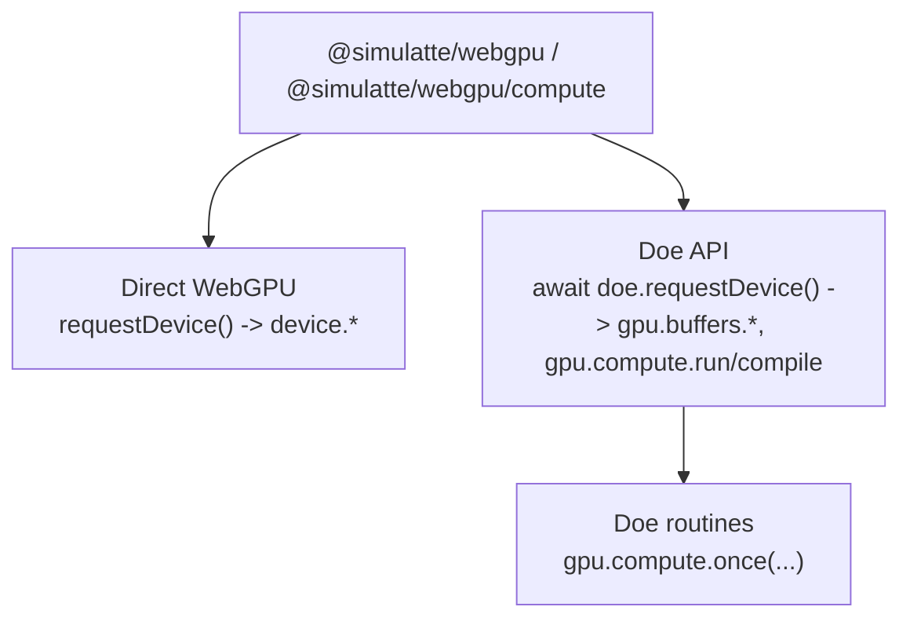

# @simulatte/webgpu

Headless WebGPU for Node.js and Bun, powered by Doe.

<p align="center">
  
</p>

Run real WebGPU workloads in Node.js and Bun.

This package gives you two immediate entry points:

- full headless WebGPU parity through `requestDevice()` and `device.*`
- lower-boilerplate Doe API + routines when you want the same workload with far less setup

It is a headless package: DOM/canvas ownership and browser-process parity
belong to the separate `nursery/fawn-browser` lane.

## Start here

### Doe routines: one-shot compute in a few lines

```js
import { doe } from "@simulatte/webgpu/compute";

const gpu = await doe.requestDevice();

const result = await gpu.compute.once({
  code: `
    @group(0) @binding(0) var<storage, read> src: array<f32>;
    @group(0) @binding(1) var<storage, read_write> dst: array<f32>;

    @compute @workgroup_size(4)
    fn main(@builtin(global_invocation_id) gid: vec3u) {
      let i = gid.x;
      dst[i] = src[i] * 3.0;
    }
  `,
  inputs: [new Float32Array([1, 2, 3, 4])],
  output: { type: Float32Array },
  workgroups: 1,
});

console.log(result); // Float32Array(4) [ 3, 6, 9, 12 ]
```

The same package also exposes the raw WebGPU path for the same class of work:
`requestDevice()`, `device.createBuffer(...)`, `device.createComputePipeline(...)`,
and explicit bind groups/command encoders are all there when you want the full
surface directly.

### Benchmarked package surface

The package is not just a wrapper API. It is the headless package surface of
Doe, Fawn's Zig-first WebGPU runtime, and it is exercised as a measured package
surface with explicit package lanes.

<p align="center">
  
</p>

`@simulatte/webgpu` is the headless package surface of the broader
[Fawn](https://github.com/clocksmith/fawn) project. The same repository also
carries the Doe runtime itself, benchmarking and verification tooling, and the
separate `nursery/fawn-browser` Chromium/browser integration lane.

## Install

```bash
npm install @simulatte/webgpu
```

The install ships platform-specific prebuilds for macOS arm64 (Metal) and
Linux x64 (Vulkan). If no prebuild matches your platform, the installer falls
back to building the native addon with `node-gyp` only; it does not build or
bundle `libwebgpu_doe` and the required Dawn sidecar for you. On unsupported
platforms, use a local Fawn workspace build for those runtime libraries.

## Choose a surface

| Import                      | Surface               | Includes                                                  |
| --------------------------- | --------------------- | --------------------------------------------------------- |
| `@simulatte/webgpu`         | Default full surface  | Buffers, compute, textures, samplers, render, Doe API + routines |
| `@simulatte/webgpu/compute` | Compute-first surface | Buffers, compute, copy/upload/readback, Doe API + routines |
| `@simulatte/webgpu/full`    | Explicit full surface | Same contract as the default package surface              |

Use `@simulatte/webgpu/compute` when you want the constrained package contract
for AI workloads and other buffer/dispatch-heavy headless execution. The
compute surface intentionally omits render and sampler methods from the JS
facade.

## Quick examples

### Inspect the provider

```js
import { providerInfo } from "@simulatte/webgpu";

console.log(providerInfo());
```

### Request a full device

```js
import { requestDevice } from "@simulatte/webgpu";

const device = await requestDevice();
console.log(device.limits.maxBufferSize);
```

### Request a compute-only device

```js
import { requestDevice } from "@simulatte/webgpu/compute";

const device = await requestDevice();
console.log(typeof device.createComputePipeline); // "function"
console.log(typeof device.createRenderPipeline); // "undefined"
```

### Doe API: explicit buffers, lower boilerplate

```js
import { doe } from "@simulatte/webgpu/compute";

const gpu = await doe.requestDevice();
const src = gpu.buffers.fromData(new Float32Array([1, 2, 3, 4]));
const dst = gpu.buffers.like(src, {
  usage: "storageReadWrite",
});

await gpu.compute.run({
  code: `
    @group(0) @binding(0) var<storage, read> src: array<f32>;
    @group(0) @binding(1) var<storage, read_write> dst: array<f32>;

    @compute @workgroup_size(4)
    fn main(@builtin(global_invocation_id) gid: vec3u) {
      let i = gid.x;
      dst[i] = src[i] * 2.0;
    }
  `,
  // Doe infers storageRead / storageReadWrite access from the buffer usage tokens above.
  bindings: [src, dst],
  workgroups: 1,
});

console.log(Array.from(await gpu.buffers.read(dst, Float32Array))); // [2, 4, 6, 8]
```

### Doe routines: one-shot typed-array flow

See **Start here** above for the smallest `gpu.compute.once(...)` path.

The package exposes three layers over the same runtime:



- `Direct WebGPU`
  raw `requestDevice()` plus direct `device.*`
- `Doe API`
  explicit Doe surface for lower-boilerplate buffer and compute flows
- `Doe routines`
  more opinionated Doe flows where the runtime carries more of the operation

Examples for each style ship in:

- `examples/direct-webgpu/`
- `examples/doe-api/`
- `examples/doe-routines/`

The direct WebGPU compute-dispatch example in `examples/direct-webgpu/compute-dispatch.js`
is intentionally the same kind of workload as the Doe API and Doe routines examples:
the first wow is raw WebGPU parity, the second is that Doe can collapse the same
job into much less boilerplate when you want it to.

`doe` is the package's shared Doe surface over the runtime. It is available
from both `@simulatte/webgpu` and `@simulatte/webgpu/compute`.

- `await doe.requestDevice()` gets a bound helper object in one step; use
  `doe.bind(device)` when you already have a device.
- `gpu.buffers.*`, `gpu.compute.run(...)`, and `gpu.compute.compile(...)` are
  the main `Doe API` surface.
- `gpu.compute.once(...)` is currently the first `Doe routines` path.

The Doe API and Doe routines surface is the same on both package surfaces.
What differs is the raw device beneath it: `@simulatte/webgpu/compute` returns a compute-only facade,
while `@simulatte/webgpu` keeps the full headless device surface.
Binding access is inferred from Doe helper-created buffer usage when possible.
For raw WebGPU buffers or non-bindable/ambiguous usage, pass
`{ buffer, access }` explicitly.

## What this package is

`@simulatte/webgpu` is the canonical package surface for Doe. Node uses an
N-API addon while Bun uses the package FFI runtime surface to load
`libwebgpu_doe`. Current builds still ship a Dawn sidecar where proc
resolution requires it.

Doe is Fawn's Zig-first WebGPU runtime with explicit profile and quirk binding,
a native WGSL pipeline (`lexer -> parser -> semantic analysis -> IR -> backend
emitters`), and explicit Vulkan/Metal/D3D12 execution paths in one system.
Optional `-Dlean-verified=true` builds use Lean 4 as build-time proof support,
not as a runtime interpreter. When a condition is proved ahead of time, Doe can
remove that runtime branch instead of re-checking it on every command; package
consumers should not assume that path by default.

## Verify your install

```bash
npm run smoke
npm test
npm run test:bun
```

`npm run smoke` checks native library loading and a GPU round-trip. `npm test`
covers the Node package contract and a packed-tarball export/import check.

## Caveats

- This is a headless package, not a browser DOM/canvas package.
- `@simulatte/webgpu/compute` is intentionally narrower than the default full
  surface.
- Bun uses the package FFI runtime surface while Node uses the addon-backed
  runtime entry. Package-surface contract tests are green, and package
  benchmark rows are positioning data rather than the source of truth for
  strict backend-native Doe-vs-Dawn claims.

## Further reading

- [API contract](./api-contract.md)
- [Support contracts](./support-contracts.md)
- [Compatibility scope](./compat-scope.md)
- [Layering plan](./layering-plan.md)
- [Headless WebGPU comparison](./headless-webgpu-comparison.md)
- [Zig source inventory](./zig-source-inventory.md)
