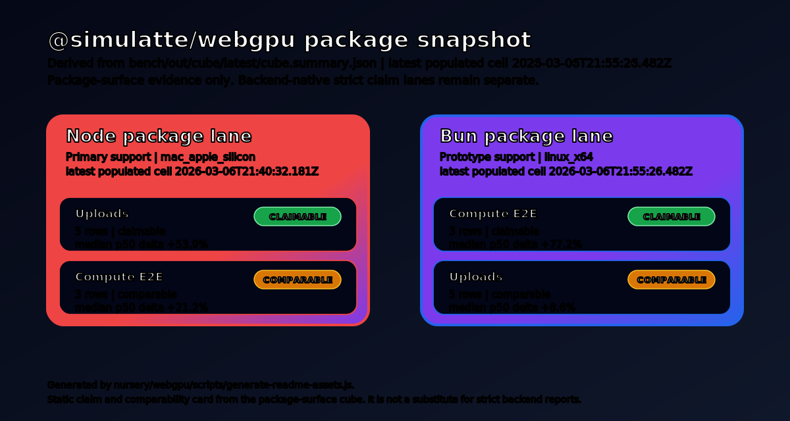

# @simulatte/webgpu

Headless WebGPU for Node.js and Bun, powered by Doe, Fawn's Zig WebGPU
runtime.

<p align="center">
  
</p>

Use this package for headless compute, CI, benchmarking, and offscreen GPU
execution. It is built for explicit runtime behavior, deterministic
traceability, and artifact-backed performance work. It is not a DOM/canvas
package and it should not be read as a promise of full browser-surface parity.

## Quick examples

### Inspect the provider

```js
import { providerInfo } from "@simulatte/webgpu";

console.log(providerInfo());
```

### Request a device

```js
import { requestDevice } from "@simulatte/webgpu";

const device = await requestDevice();
console.log(device.limits.maxBufferSize);
```

### Estimate pi on the GPU

65,536 threads each test 1,024 points inside the unit square. Each thread
hashes its index to produce sample coordinates, counts how many land inside
the unit circle, and writes its count to a results array. The CPU sums the
counts and computes pi ≈ 4 × hits / total.

```js
import { globals, requestDevice } from "@simulatte/webgpu";

const { GPUBufferUsage, GPUMapMode, GPUShaderStage } = globals;
const device = await requestDevice();

const THREADS = 65536;
const WORKGROUP_SIZE = 256;
const SAMPLES_PER_THREAD = 1024;

if (THREADS % WORKGROUP_SIZE !== 0) {
  throw new Error("THREADS must be a multiple of WORKGROUP_SIZE");
}

const shader = device.createShaderModule({
  code: `
    @group(0) @binding(0) var<storage, read_write> counts: array<u32>;

    fn hash(n: u32) -> u32 {
      var x = n;
      x ^= x >> 16u;
      x *= 0x45d9f3bu;
      x ^= x >> 16u;
      x *= 0x45d9f3bu;
      x ^= x >> 16u;
      return x;
    }

    @compute @workgroup_size(${WORKGROUP_SIZE})
    fn main(@builtin(global_invocation_id) gid: vec3u) {
      var count = 0u;
      for (var i = 0u; i < ${SAMPLES_PER_THREAD}u; i += 1u) {
        let idx = gid.x * ${SAMPLES_PER_THREAD}u + i;
        let x = f32(hash(idx * 2u)) / 4294967295.0;
        let y = f32(hash(idx * 2u + 1u)) / 4294967295.0;
        if x * x + y * y <= 1.0 {
          count += 1u;
        }
      }
      counts[gid.x] = count;
    }
  `,
});

const bindGroupLayout = device.createBindGroupLayout({
  entries: [{
    binding: 0,
    visibility: GPUShaderStage.COMPUTE,
    buffer: { type: "storage" },
  }],
});

const pipeline = device.createComputePipeline({
  layout: device.createPipelineLayout({ bindGroupLayouts: [bindGroupLayout] }),
  compute: { module: shader, entryPoint: "main" },
});

const countsBuffer = device.createBuffer({
  size: THREADS * 4,
  usage: GPUBufferUsage.STORAGE | GPUBufferUsage.COPY_SRC,
});
const readback = device.createBuffer({
  size: THREADS * 4,
  usage: GPUBufferUsage.COPY_DST | GPUBufferUsage.MAP_READ,
});

const bindGroup = device.createBindGroup({
  layout: bindGroupLayout,
  entries: [{ binding: 0, resource: { buffer: countsBuffer } }],
});

const encoder = device.createCommandEncoder();
const pass = encoder.beginComputePass();
pass.setPipeline(pipeline);
pass.setBindGroup(0, bindGroup);
pass.dispatchWorkgroups(THREADS / WORKGROUP_SIZE);
pass.end();
encoder.copyBufferToBuffer(countsBuffer, 0, readback, 0, THREADS * 4);
device.queue.submit([encoder.finish()]);

await readback.mapAsync(GPUMapMode.READ);
const counts = new Uint32Array(readback.getMappedRange());
const hits = counts.reduce((a, b) => a + b, 0);
readback.unmap();

const total = THREADS * SAMPLES_PER_THREAD;
const pi = 4 * hits / total;
console.log(`${total.toLocaleString()} samples → pi ≈ ${pi.toFixed(6)}`);
```

Expected output will vary slightly, but it should look like:

```
67,108,864 samples → pi ≈ 3.14...
```

Increase `SAMPLES_PER_THREAD` for more precision.

## What this package is

`@simulatte/webgpu` is the canonical package surface for Doe. Node uses an
N-API addon and Bun currently routes through the same addon-backed runtime
entry to load `libwebgpu_doe`. Current package builds still ship a Dawn sidecar
where proc resolution requires it. The experimental raw Bun FFI path remains in
`src/bun-ffi.js`, but it is not the default package entry.

Doe is a Zig-first WebGPU runtime with explicit allocator control, startup-time
profile and quirk binding, a native WGSL pipeline (`lexer -> parser ->
semantic analysis -> IR -> backend emitters`), and explicit
Vulkan/Metal/D3D12 execution paths in one system. Optional
`-Dlean-verified=true` builds use Lean 4 where proved invariants can be
hoisted out of runtime branches instead of being re-checked on every command;
package consumers should not assume that path by default.

Doe also keeps adapter and driver quirks explicit. Profile selection happens at
startup, quirk data is schema-backed, and the runtime binds the selected
profile instead of relying on hidden per-command fallback logic.

## Current scope

- Node is the primary supported package surface (N-API bridge).
- Bun has API parity with Node through the package's addon-backed runtime entry
  (61/61 contract tests passing). Bun benchmark cube maturity remains
  prototype until the comparable macOS cells stabilize across repeated
  governed runs.
- Package-surface comparisons should be read through the benchmark cube outputs
  under `bench/out/cube/`, not as a replacement for strict backend reports.

<p align="center">
  
</p>

Package-surface benchmark evidence lives under `bench/out/cube/latest/`. Read
those rows as package-surface positioning data, not as substitutes for strict
backend-native claim lanes.

## Quickstart

```bash
npm install @simulatte/webgpu
```

```js
import { providerInfo, requestDevice } from "@simulatte/webgpu";

console.log(providerInfo());

const device = await requestDevice();
console.log(device.limits.maxBufferSize);
```

The install ships platform-specific prebuilds for macOS arm64 (Metal) and
Linux x64 (Vulkan). The commands are the same on both platforms; the correct
backend is selected automatically. The only external prerequisite is GPU
drivers on the host. If no prebuild matches your platform, install falls back
to building from source via node-gyp.

## Verify your install

After installing, run the smoke test to confirm native library loading and a
GPU round-trip:

```bash
npm run smoke
```

To run the full contract test suite (adapter, device, buffers, compute
dispatch with readback, textures, samplers):

```bash
npm test                     # Node
npm run test:bun             # Bun
```

If `npm run smoke` fails, check that GPU drivers are installed and that your
platform is supported (macOS arm64 or Linux x64).

## Building from source

Use this when working from the Fawn repo checkout or rebuilding the addon
against a local Doe runtime build.

```bash
# From the Fawn workspace root:
cd zig && zig build dropin   # build libwebgpu_doe + Dawn sidecar

cd nursery/webgpu
npm run build:addon          # compile doe_napi.node from source
npm run smoke                # verify native loading + GPU round-trip
npm test                     # Node contract tests
npm run test:bun             # Bun contract tests
```

Current macOS arm64 validation for `0.2.3` was rerun on March 10, 2026 with:

```bash
cd zig && zig build dropin

cd nursery/webgpu
npm run build:addon
npm run smoke
npm test
npm run test:bun
npm run prebuild -- --skip-addon-build
npm pack --dry-run
```

That path is green on the Apple Metal host. `npm run test:bun` also passed on
this host (`61 passed, 0 failed`) once Bun was added to `PATH`.

For Fawn development setup, build toolchain requirements, and benchmark
harness usage, see the [Fawn project README](../../README.md).

## Packaging prebuilds (CI / release)

```bash
npm run prebuild             # assembles prebuilds/<platform>-<arch>/
```

Supported prebuild targets: macOS arm64 (Metal), Linux x64 (Vulkan),
Windows x64 (D3D12). Host GPU drivers are the only external prerequisite.
Install uses prebuilds when available, falls back to node-gyp from source.
Tracked `prebuilds/<platform>-<arch>/` directories are the source of truth for
reproducible package publishes. If a prebuild exists only on one local machine
and is not committed, `npm pack` output will differ by environment.
Generated `.tgz` package archives are release outputs and should not be
committed to the repo.
Prebuild `metadata.json` now records `doeBuild.leanVerifiedBuild` and
`proofArtifactSha256`, and `providerInfo()` surfaces the same values when
metadata is present.

Package publication still depends on the governed Linux Vulkan release lane in
[`process.md`](../../process.md). A green macOS package rerun is necessary, but
not sufficient, for a release publish.

## Current caveats

- This package is for headless benchmarking and CI workflows, not full browser
  parity.
- Node provider comparisons are host-local package/runtime evidence measured
  with package-level timers. They are useful surface-positioning data, not
  backend claim substantiation or a broad "the package is faster" claim.
- `@simulatte/webgpu` does not yet have a single broad cross-surface speed
  claim. Current performance evidence is split across Node package-surface
  runs, prototype Bun package-surface runs, and workload-specific strict
  backend reports.
- Linux Node Doe-native path is now wired end-to-end (Linux guard removed).
  No `DOE_WEBGPU_LIB` env var needed when prebuilds or workspace artifacts
  are present.
- Fresh macOS package evidence from March 10, 2026 is reflected in
  `bench/out/cube/latest/` (generated `2026-03-10T20:31:02.431911Z`):
  Bun `uploads`, `compute_e2e`, and `full_comparable` are `claimable`;
  Node `uploads`, `compute_e2e`, and `full_comparable` are also `claimable`.
- Bun has API parity with Node (61/61 contract tests). The package-default Bun
  entry currently routes through the addon-backed runtime, while
  `src/bun-ffi.js` remains experimental. Bun benchmark lane is at
  `bench/bun/compare.js`; benchmark interpretations should note which runtime
  entry was exercised. Latest fresh macOS run
  (`bench/out/bun-doe-vs-webgpu/doe-vs-bun-webgpu-2026-03-10T195022524Z.json`)
  executes all `12` current workloads and has `9` comparable rows, all `9`
  claimable. `compute_e2e_{256,4096,65536}` and
  `copy_buffer_to_buffer_4kb` are claimable in the full macOS package lane.
  The remaining three rows are intentional directional-only workloads
  (`submit_empty`, `pipeline_create`, `compute_dispatch_simple`).
- Latest fresh macOS Node package run
  (`bench/out/node-doe-vs-dawn-claim-full/doe-vs-dawn-node-2026-03-10T202406545Z.json`)
  has `12` total rows, `9` comparable rows, and all `9` comparable rows are
  claimable. `compute_e2e_{256,4096,65536}`, `copy_buffer_to_buffer_4kb`,
  and the current upload set are claimable in the full package lane. The
  remaining three rows are intentional directional-only workloads
  (`submit_empty`, `pipeline_create`, `compute_dispatch_simple`).
- Self-contained install ships prebuilt `doe_napi.node` + `libwebgpu_doe` +
  Dawn sidecar per platform. See **Verify your install** above.
- API details live in `API_CONTRACT.md`.
- Compatibility scope is documented in `COMPAT_SCOPE.md`.
