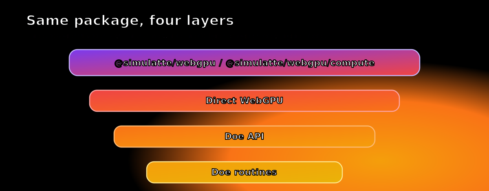

# @simulatte/webgpu

<table>
  <tr>
    <td valign="middle">
      <strong>Run real WebGPU workloads in Node.js and Bun with Doe, the WebGPU runtime from Fawn.</strong>
    </td>
    <td valign="middle">
      
    </td>
  </tr>
</table>

`@simulatte/webgpu` is Fawn's headless WebGPU package for Node.js and Bun: use
the raw WebGPU API through `requestDevice()` and `device.*`, or move up to the
Doe API when you want the same runtime with less setup. Browser DOM/canvas
ownership lives in the separate `nursery/fawn-browser` lane.

Terminology in this README is deliberate:

- `Doe runtime` means the Zig/native WebGPU runtime underneath the package
- `Doe API` means the explicit JS convenience surface under `doe`, `gpu.buffer.*`,
  `gpu.kernel.run(...)`, `gpu.kernel.create(...)`, and `gpu.compute(...)`

The current implemented helper contract is documented in
[api-contract.md](./api-contract.md). The proposed naming cleanup for the Doe
helper surface is documented in [doe-api-design.md](./doe-api-design.md).
The generated interactive Doe API reference lives at
[docs/doe-api-reference.html](./docs/doe-api-reference.html).

The same helper layer is now also published separately as
`@simulatte/webgpu-doe` when you want the Doe API as an independent package
boundary.

## Start here

### From direct WebGPU to Doe API

The same simple compute pass, shown first at the raw WebGPU layer and then at
the explicit Doe API layer.

#### 1. Direct WebGPU

```js
import { globals, requestDevice } from "@simulatte/webgpu";

const device = await requestDevice();
const input = new Float32Array([1, 2, 3, 4]);
const bytes = input.byteLength;

const src = device.createBuffer({
  size: bytes,
  usage: globals.GPUBufferUsage.STORAGE | globals.GPUBufferUsage.COPY_DST,
});
device.queue.writeBuffer(src, 0, input);

const dst = device.createBuffer({
  size: bytes,
  usage: globals.GPUBufferUsage.STORAGE | globals.GPUBufferUsage.COPY_SRC,
});

const readback = device.createBuffer({
  size: bytes,
  usage: globals.GPUBufferUsage.COPY_DST | globals.GPUBufferUsage.MAP_READ,
});

const pipeline = device.createComputePipeline({
  layout: "auto",
  compute: {
    module: device.createShaderModule({
      code: `
        @group(0) @binding(0) var<storage, read> src: array<f32>;
        @group(0) @binding(1) var<storage, read_write> dst: array<f32>;

        @compute @workgroup_size(4)
        fn main(@builtin(global_invocation_id) gid: vec3u) {
          let i = gid.x;
          dst[i] = src[i] * 2.0;
        }
      `,
    }),
    entryPoint: "main",
  },
});

const bindGroup = device.createBindGroup({
  layout: pipeline.getBindGroupLayout(0),
  entries: [
    { binding: 0, resource: { buffer: src } },
    { binding: 1, resource: { buffer: dst } },
  ],
});

const encoder = device.createCommandEncoder();
const pass = encoder.beginComputePass();
pass.setPipeline(pipeline);
pass.setBindGroup(0, bindGroup);
pass.dispatchWorkgroups(1);
pass.end();
encoder.copyBufferToBuffer(dst, 0, readback, 0, bytes);

device.queue.submit([encoder.finish()]);
await device.queue.onSubmittedWorkDone();

await readback.mapAsync(globals.GPUMapMode.READ);
const result = new Float32Array(readback.getMappedRange().slice(0));
readback.unmap();

console.log(result); // Float32Array(4) [ 2, 4, 6, 8 ]
```

#### 2. Doe API

Explicit Doe buffers and dispatch when you want less boilerplate but still want
to manage the resources yourself.

```js
import { doe } from "@simulatte/webgpu/compute";

const gpu = await doe.requestDevice();
const src = gpu.buffer.create({ data: Float32Array.of(1, 2, 3, 4) });
const dst = gpu.buffer.create({ size: src.size, usage: "storageReadWrite" });

await gpu.kernel.run({
  code: `
    @group(0) @binding(0) var<storage, read> src: array<f32>;
    @group(0) @binding(1) var<storage, read_write> dst: array<f32>;

    @compute @workgroup_size(4)
    fn main(@builtin(global_invocation_id) gid: vec3u) {
      let i = gid.x;
      dst[i] = src[i] * 2.0;
    }
  `,
  // Access is inferred from the Doe buffer usage above.
  bindings: [src, dst],
  workgroups: 1,
});

console.log(await gpu.buffer.read({ buffer: dst, type: Float32Array })); // Float32Array(4) [ 2, 4, 6, 8 ]
```

What this package gives you:

- `requestDevice()` gives you real headless WebGPU
- `doe` gives you the same runtime with less boilerplate and explicit resource control
- `gpu.compute(...)` is the more opinionated Doe API helper when you do not want to manage buffers and readback yourself

#### 3. Doe API: one-shot tensor matmul

This is the more opinionated one-shot end of the Doe API: you pass typed
arrays and an output spec, and the package handles upload, output allocation,
dispatch, and readback while the shader and tensor shapes stay explicit.

```js
import { doe } from "@simulatte/webgpu/compute";

const gpu = await doe.requestDevice();
const [M, K, N] = [256, 512, 256];

const lhs = Float32Array.from({ length: M * K }, (_, i) => (i % 17) / 17);
const rhs = Float32Array.from({ length: K * N }, (_, i) => (i % 13) / 13);
const dims = new Uint32Array([M, K, N, 0]);

const result = await gpu.compute({
  code: `
    struct Dims {
      m: u32,
      k: u32,
      n: u32,
      _pad: u32,
    };

    @group(0) @binding(0) var<uniform> dims: Dims;
    @group(0) @binding(1) var<storage, read> lhs: array<f32>;
    @group(0) @binding(2) var<storage, read> rhs: array<f32>;
    @group(0) @binding(3) var<storage, read_write> out: array<f32>;

    @compute @workgroup_size(8, 8)
    fn main(@builtin(global_invocation_id) gid: vec3u) {
      let row = gid.y;
      let col = gid.x;
      if (row >= dims.m || col >= dims.n) {
        return;
      }

      var acc = 0.0;
      for (var i = 0u; i < dims.k; i = i + 1u) {
        acc += lhs[row * dims.k + i] * rhs[i * dims.n + col];
      }
      out[row * dims.n + col] = acc;
    }
  `,
  inputs: [{ data: dims, usage: "uniform", access: "uniform" }, lhs, rhs],
  output: {
    type: Float32Array,
    size: M * N * Float32Array.BYTES_PER_ELEMENT,
  },
  workgroups: [Math.ceil(N / 8), Math.ceil(M / 8)],
});

console.log(result.subarray(0, 8)); // Float32Array(8) [ ... ]
```

### Benchmark snapshot

This package is the headless package surface of the Doe runtime, Fawn's
Zig-first WebGPU implementation, and it is benchmarked through separate
Node and Bun package lanes.

<p align="center">
  
</p>

`@simulatte/webgpu` is the headless package surface of the broader
[Fawn](https://github.com/clocksmith/fawn) project. The same repository also
carries the Doe runtime itself, benchmarking and verification tooling, and the
separate `nursery/fawn-browser` Chromium/browser integration lane.

## Install

```bash
npm install @simulatte/webgpu
```

If you want the helper-only extraction explicitly:

```bash
npm install @simulatte/webgpu @simulatte/webgpu-doe
```

The install ships platform-specific prebuilds for macOS arm64 (Metal) and
Linux x64 (Vulkan). If no prebuild matches your platform, the installer falls
back to building the native addon with `node-gyp` only; it does not build or
bundle `libwebgpu_doe` and the required Dawn sidecar for you. On unsupported
platforms, use a local Fawn workspace build for those runtime libraries.

## Choose a surface

| Import                      | Surface               | Includes                                                         |
| --------------------------- | --------------------- | ---------------------------------------------------------------- |
| `@simulatte/webgpu`         | Default full surface  | Buffers, compute, textures, samplers, render, Doe API            |
| `@simulatte/webgpu/compute` | Compute-first surface | Buffers, compute, copy/upload/readback, Doe API                  |
| `@simulatte/webgpu/full`    | Explicit full surface | Same contract as the default package surface                     |

Use `@simulatte/webgpu/compute` when you want the constrained package contract
for AI workloads and other buffer/dispatch-heavy headless execution. The
compute surface intentionally omits render and sampler methods from the JS
facade.

## Basic entry points

### Inspect the provider

```js
import { providerInfo } from "@simulatte/webgpu";

console.log(providerInfo());
```

### Request a full device

```js
import { requestDevice } from "@simulatte/webgpu";

const device = await requestDevice();
console.log(device.limits.maxBufferSize);
```

### Request a compute-only device

```js
import { requestDevice } from "@simulatte/webgpu/compute";

const device = await requestDevice();
console.log(typeof device.createComputePipeline); // "function"
console.log(typeof device.createRenderPipeline); // "undefined"
```

## API layers

The package gives you two API styles over the same Doe runtime:

<p align="center">
  
</p>

- `Direct WebGPU`
  raw `requestDevice()` plus direct `device.*`
- `Doe API`
  explicit Doe surface for lower-boilerplate buffer, kernel, and one-shot compute flows

Examples for each style ship in:

- `examples/direct-webgpu/`
- `examples/doe-api/`

The Doe example directory is organized by API shape:

- `buffers-readback.js` for `gpu.buffer.*`
- `kernel-run.js` for `gpu.kernel.run(...)`
- `kernel-create-and-dispatch.js` for `gpu.kernel.create(...)` plus `kernel.dispatch(...)`
- `compute-one-shot*.js` for the `gpu.compute(...)` helper family

`doe` is the package's shared JS convenience surface over the Doe runtime. It is available
from both `@simulatte/webgpu` and `@simulatte/webgpu/compute`.

- `await doe.requestDevice()` gets a bound helper object in one step; use
  `doe.bind(device)` when you already have a device.
- `gpu.buffer.*`, `gpu.kernel.run(...)`, and `gpu.kernel.create(...)` are
  the main `Doe API` surface.
- `gpu.compute(...)` is the single more opinionated one-shot helper inside the same Doe API surface.
- `doe` itself is just the binding entrypoint; the actual helper methods live
  on the returned `gpu` object.

The Doe API surface is the same on both package surfaces. The difference is the
raw device beneath it:

- `@simulatte/webgpu/compute` returns a compute-only facade
- `@simulatte/webgpu` keeps the full headless device surface

Binding access is inferred from Doe helper-created buffer usage when possible.
For raw WebGPU buffers or non-bindable/ambiguous usage, pass
`{ buffer, access }` explicitly.

## Runtime notes

`@simulatte/webgpu` is the canonical package surface for the Doe runtime. Node uses the
addon-backed path. Bun uses a platform-dependent bridge today: Linux routes
through the package FFI surface, while macOS currently uses the full
addon-backed path for correctness parity. Current builds still ship a Dawn
sidecar where proc resolution requires it.

The Doe runtime is Fawn's Zig-first WebGPU implementation with explicit profile
and quirk binding, a native WGSL pipeline (`lexer -> parser -> semantic
analysis -> IR -> backend emitters`), and explicit Vulkan/Metal/D3D12
execution paths in one system.
Optional `-Dlean-verified=true` builds use Lean 4 as build-time proof support,
not as a runtime interpreter. When a condition is proved ahead of time, the Doe
runtime can remove that branch instead of re-checking it on every command;
package consumers should not assume that path by default.

## Verify your install

```bash
npm run smoke
npm test
npm run test:bun
```

`npm run smoke` checks native library loading and a GPU round-trip. `npm test`
covers the Node package contract and a packed-tarball export/import check.

## Caveats

- This is a headless package, not a browser DOM/canvas package.
- `@simulatte/webgpu/compute` is intentionally narrower than the default full
  surface.
- Bun currently uses a platform-dependent bridge layer under the same package
  contract: FFI on Linux, full/addon-backed on macOS. Package-surface contract
  tests are green, and package benchmark rows are positioning data rather than
  the source of truth for strict backend-native Doe-vs-Dawn claims.

## Further reading

- [Architecture](./architecture.md) — full layer stack from Zig native to package exports
- [API contract](./api-contract.md)
- [Doe API design](./doe-api-design.md)
- [Support contracts](./support-contracts.md)
- [Scope and non-goals](./api-contract.md#scope-and-non-goals)
- [Headless WebGPU comparison](./headless-webgpu-comparison.md)
