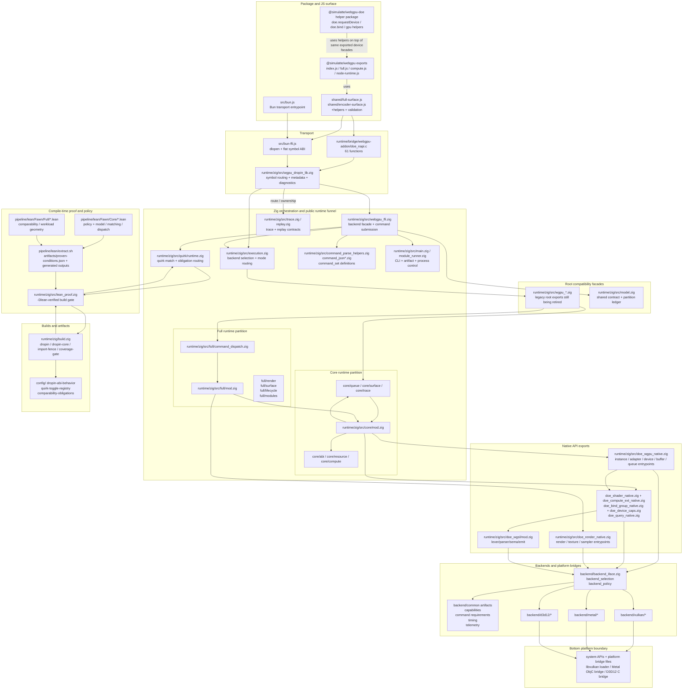

# @simulatte/webgpu architecture

This document maps the full runtime stack from Zig native code to the npm
package surface. It is the single reference for how layers compose.

For contract details see the companion docs:

- `api-contract.md` — current implemented JS contract, scope and non-goals
- `doe-api-design.md` — helper naming direction
- `support-contracts.md` — product scope and support tiers

## Layer diagram

For the condensed package boundary map, see the root
[`README.md`](../../README.md). That overview is the best starting point when
you want to understand where application code stops, where
`@simulatte/webgpu` stops, where `@simulatte/webgpu-doe` sits, and where the
native Doe runtime begins.

The stack below is the package-local inventory view of the same layers.

```
┌──────────────────────────────────────────────────────────┐
│  Package exports                                         │
│  create · requestAdapter · requestDevice · doe · globals │
│  providerInfo · preflightShaderSource · setupGlobals     │
│  createDoeRuntime · runDawnVsDoeCompare                  │
│  10 functions                                            │
├──────────────────────────────────────────────────────────┤
│  Doe helpers  (@simulatte/webgpu-doe)                    │
│  doe.requestDevice · doe.bind                            │
│  gpu.buffer.create · gpu.buffer.read                     │
│  gpu.kernel.run · gpu.kernel.create                      │
│  gpu.compute                                             │
│  7 methods across 3 namespaces (buffer, kernel, compute) │
├──────────────────────────────────────────────────────────┤
│  WebGPU JS surface  (shared/full-surface.js,             │
│                       shared/encoder-surface.js)         │
│  DoeGPU · DoeGPUAdapter · DoeGPUDevice                   │
│  DoeGPUBuffer · DoeGPUQueue · DoeGPUCommandEncoder       │
│  DoeGPUComputePassEncoder · DoeGPURenderPassEncoder      │
│  DoeGPUTexture · DoeGPUShaderModule · DoeGPUQuerySet     │
│  + 6 trivial resource classes                            │
│  ~95 methods across 16 classes                           │
│  This layer is WebGPU spec conformance, not Doe API.     │
├────────────────┬─────────────────────────────────────────┤
│  N-API addon   │  Bun FFI binding                        │
│  (Node.js)     │  (Bun)                                  │
│  doe_napi.c    │  bun-ffi.js                             │
│  61 functions  │  65 base + 13 Darwin-only = 78 symbols  │
│                │                                         │
│  Parallel transports — same JS surface consumes either.  │
│  Not 1:1: N-API has fused batch ops, Bun FFI has flat    │
│  variants and platform-conditional Doe-native symbols.   │
├────────────────┴─────────────────────────────────────────┤
│  Zig native ABI  (runtime/zig/src/doe_*.zig)                     │
│  76 pub export fn with C calling convention               │
│                                                          │
│  doe_wgpu_native.zig ···· 29  instance/adapter/device/   │
│                                buffer/queue/encoder      │
│  doe_shader_native.zig ·· 11  shader module/pipeline/    │
│                                error reporting           │
│  doe_compute_ext_native .. 7  compute pass ops           │
│  doe_bind_group_native .. 6   bind group/pipeline layout │
│  doe_render_native.zig ·· 17  texture/sampler/render     │
│  doe_device_caps.zig ···· 4   feature/limits queries     │
│  doe_query_native.zig ··· 4   timestamp queries          │
├──────────────────────────────────────────────────────────┤
│  WGSL compiler  (runtime/zig/src/doe_wgsl/)                      │
│  lexer → parser → sema → ir_builder → ir_validate        │
│  → emit_msl_ir / emit_spirv / emit_hlsl / emit_dxil     │
├──────────────────────────────────────────────────────────┤
│  Metal / Vulkan / D3D12 backends                         │
│  runtime/zig/src/backend/{metal,vulkan,d3d12}/                   │
└──────────────────────────────────────────────────────────┘
```

## Full runtime funnel with JS and Lean boundaries

This diagram is the canonical boundary map for the full stack. `core/` and
`full/` are runtime-layer Zig partitions below the JS/package surface, while
Lean lives beside the runtime as a proof/artifact input to build-time and
runtime obligation checks, not as a top-level package surface.



Read this diagram top to bottom:

- JS/package boundaries stop at the transport layer (`doe_napi.c` or Bun FFI).
- The runtime funnel starts at `wgpu_dropin_lib.zig`, `webgpu_ffi.zig`, and the
  root `wgpu_*.zig` compatibility facades.
- `core/` and `full/` live entirely inside the Zig runtime layer and are
  enforced by `zig build import-fence` plus the separate `dropin-core` build.
- Lean is a sibling proof/policy lane that emits artifacts consumed by
  `lean_proof.zig` and `quirk/runtime.zig`; it is not a JS-facing runtime tier.

## Layer details

### 1. Zig native ABI (76 functions)

The bottom of the stack. Every GPU operation is a `pub export fn` with C
calling convention in `runtime/zig/src/doe_*.zig`. These functions directly call Metal,
Vulkan, or D3D12 backend code.

Files and responsibilities:

| File | Count | Scope |
|------|-------|-------|
| `doe_wgpu_native.zig` | 29 | Instance, adapter, device, buffer, queue, command encoder |
| `doe_shader_native.zig` | 11 | Shader module creation, compute pipeline, structured error reporting |
| `doe_compute_ext_native.zig` | 7 | Compute pass: setPipeline, setBindGroup, dispatch, end, getBindGroupLayout |
| `doe_bind_group_native.zig` | 6 | Bind group layout, bind group, pipeline layout (create + release) |
| `doe_render_native.zig` | 17 | Texture, texture view, sampler, render pipeline, render pass ops |
| `doe_device_caps.zig` | 4 | hasFeature, getLimits for adapter and device |
| `doe_query_native.zig` | 4 | Query set creation, writeTimestamp, resolveQuerySet, destroy |

Constants governing the ABI:

- `BINDINGS_PER_GROUP = 16` — MSL buffer slot formula: `group * 16 + binding`
- `MAX_BIND_GROUPS = 4` — maximum bind groups per pipeline
- `MAX_FLAT_BIND = 64` — flat buffer array size (4 * 16)

Lean proofs verify these constants produce collision-free, bounded slot
mappings (`Fawn.Core.BindGroupSlot`).

### 2. Transport layer (N-API or Bun FFI)

Two parallel implementations that bridge Zig native → JavaScript. The JS
surface classes (layer 3) consume whichever transport is active at runtime.

#### N-API addon (Node.js) — 61 functions

`runtime/bridge/webgpu-addon/doe_napi.c` wraps Zig functions via Node-API. Includes fused
operations not in Bun FFI:

- `doe_submit_batched` — batch command buffer submission
- `doe_submit_compute_dispatch_copy` — fused dispatch + copy
- `doe_flush_and_map_sync` — fused flush + synchronous map
- `doe_buffer_assert_mapped_prefix_f32` — assertion helper

#### Bun FFI (Bun) — 78 symbols

`src/bun-ffi.js` uses `dlopen` to bind C symbols directly. Uses `wgpu*`
naming for standard WebGPU C API symbols and `doeNative*` for Doe-specific
functions.

Differences from N-API:

- Has "flat" variants (`doeRequestAdapterFlat`, `doeBufferMapAsyncFlat`) for
  struct layout compatibility with Bun's FFI
- 13 Darwin-only symbols added conditionally (error getters, query set,
  queue flush, compute dispatch flush)
- Does not have N-API's fused batch operations

### 3. WebGPU JS surface (~95 methods, 16 classes)

`src/shared/full-surface.js` and `src/shared/encoder-surface.js` implement
the WebGPU API as JavaScript classes. This is spec-conformant glue, not
Doe-specific API.

| Class | Key methods |
|-------|-------------|
| `DoeGPU` | `requestAdapter`, `getPreferredCanvasFormat` |
| `DoeGPUAdapter` | `requestDevice`, `hasFeature`, `getFeatures`, `getLimits` |
| `DoeGPUDevice` | 11 `create*` methods, `getQueue`, `hasFeature`, `getLimits`, `destroy` |
| `DoeGPUBuffer` | `mapAsync`, `getMappedRange`, `unmap`, `destroy` |
| `DoeGPUQueue` | `submit`, `writeBuffer`, `copy`, `writeTimestamp` |
| `DoeGPUCommandEncoder` | `beginComputePass`, `beginRenderPass`, 4 copy methods, `finish` |
| `DoeGPUComputePassEncoder` | `setPipeline`, `setBindGroup`, `dispatchWorkgroups`, `dispatchWorkgroupsIndirect`, `end` |
| `DoeGPURenderPassEncoder` | `setPipeline`, `draw`, `drawIndexed`, `setVertexBuffer`, `setIndexBuffer`, `end` |
| `DoeGPUTexture` | `createView`, `destroy` + readonly dimension/format properties |
| `DoeGPUShaderModule` | `getCompilationInfo` |
| `DoeGPUComputePipeline` | `getBindGroupLayout` |
| `DoeGPURenderPipeline` | `getBindGroupLayout` |
| `DoeGPUQuerySet` | `destroy`, readonly `type`/`count` |

Shared helpers in `src/shared/`:

- `compiler-errors.js` — WGSL error enrichment with structured fields
- `validation.js` — input validation utilities
- `capabilities.js` — device capability detection
- `resource-lifecycle.js` — buffer/resource lifecycle helpers

### 4. Doe helpers (7 methods, 3 namespaces)

`@simulatte/webgpu-doe` provides the Doe-specific compute convenience API
across `gpu.buffer.*`, `gpu.kernel.*`, and `gpu.compute(...)`.

For exact method signatures and behavior, see
[`api-contract.md`](./api-contract.md) (section `doe`).
Type declarations: `@simulatte/webgpu-doe/src/index.d.ts`.

### 5. Package exports (10 functions)

Entry files: `src/node-runtime.js` (Node.js), `src/bun.js` (Bun),
`src/full.js` (full surface), `src/compute.js` (compute-only subset).

For exact export signatures, see
[`api-contract.md`](./api-contract.md) (sections `Top-level package API`
through `CLI contract`).

Export paths from `package.json`:

```json
{
  ".":        { "types": "./src/full.d.ts", "bun": "./src/bun.js", "default": "./src/node-runtime.js" },
  "./bun":    { "types": "./src/full.d.ts", "default": "./src/bun.js" },
  "./node":   { "types": "./src/full.d.ts", "default": "./src/node-runtime.js" },
  "./compute":{ "types": "./src/compute.d.ts", "default": "./src/compute.js" },
  "./full":   { "types": "./src/full.d.ts", "default": "./src/full.js" }
}
```

## Data flow

A typical compute dispatch flows through the stack:

```
gpu.compute({ code, inputs, output, workgroups })
  → gpu.kernel.run({ code, bindings, workgroups })   Doe helpers
    → device.createShaderModule(descriptor)           JS surface
      → addon.createShaderModule(dev, desc)           N-API transport
        → doeNativeDeviceCreateShaderModule(...)       Zig native ABI
          → doe_wgsl lexer → parser → sema → IR       WGSL compiler
          → emit_msl_ir → Metal compileLibrary         Backend
    → device.createComputePipeline(descriptor)
    → encoder.beginComputePass()
    → pass.setPipeline(pipeline)
    → pass.setBindGroup(0, bindGroup)
    → pass.dispatchWorkgroups(x, y, z)
    → pass.end()
    → encoder.finish()
    → queue.submit([commandBuffer])
    → buffer.mapAsync(GPUMapMode.READ)
    → buffer.getMappedRange()
  → return Float32Array(mappedData)
```

## Formal verification coverage

Lean proofs in `pipeline/lean/Fawn/Core/` verify properties of the native ABI layer:

- **BindGroupSlot** — slot mapping injectivity and bounds (4 theorems)
- **BufferLifecycle** — state machine idempotency, terminal state, spec gap
  documentation (9 theorems)
- **Dispatch** — identity actions, scope×command completeness (7 theorems)
- **Model** — safety class ranking, proof level requirements (2 theorems)

Proof artifacts are extracted to `pipeline/lean/artifacts/proven-conditions.json`
(40 theorems total across all modules).

## Known spec divergences

Formally documented in `Fawn.Core.BufferLifecycle`:

| Operation | WebGPU spec | Doe behavior | Reason |
|-----------|-------------|--------------|--------|
| `getMappedRange` on unmapped buffer | Validation error | Succeeds (returns UMA pointer) | Apple Silicon unified memory |
| `dispatch` with mapped buffer | Validation error | Succeeds | No mapped-state precondition check |
| `buffer.destroy` | Marks unusable | Immediately frees (`doeBufferRelease`) | Simpler lifecycle |

## Core/full runtime split

The Zig source is physically split into `core` and `full` subtrees. The JS
package is a single artifact today; the source boundary enables a future binary
split.

### Boundary rules

1. `full` composes `core`; it does not toggle `core`.
2. `core` must never import `full`.
3. `full` may depend on `core` Zig modules, Lean modules, build outputs, and JS helpers.
4. Chromium Track A depends on the full runtime artifact and browser-specific gates, not on npm package layout.

Anti-bleed:

- no `if full_enabled` branches inside `core`
- no `full` fields added to `core` structs
- no browser-policy logic added to `full`

`full` extends `core` by composition (wrapper types holding core values), never
by mutating `core` types in place.

### Import fence

`runtime/zig/src/core/**` may not import any file under `runtime/zig/src/full/**`.
`pipeline/lean/Fawn/Core/**` may not import any file under `pipeline/lean/Fawn/Full/**`.
Any exception requires redesign, not a one-off waiver.

CI enforcement for this fence is not yet implemented. It is the highest-priority
remaining structural artifact.

### Physical layout

```text
runtime/zig/src/core/
  mod.zig              (17 public exports)
  abi/                  type definitions, loader, proc aliases
  compute/              compute command module
  queue/                queue/sync FFI
  resource/             buffer, texture, copy, resource normalizers
  pipeline/trace/                tracing
  replay/               replay

runtime/zig/src/full/
  mod.zig              (7 public exports)
  render/               render API, draw loops, samplers, PLS (12 files)
  surface/              FFI surface, surface commands, macOS surface (5 files)
  lifecycle/            async diagnostics
  modules/              rendering services, compute services, resource scheduler

pipeline/lean/Fawn/Core/         BindGroupSlot, Bridge, BufferLifecycle, Dispatch, Model, Runtime
pipeline/lean/Fawn/Full/         Comparability, ComparabilityFixtures, WorkloadGeometry
```

Root compatibility facades (~57 files) remain at `runtime/zig/src/` while callers
retarget. `webgpu_ffi.zig` still owns `WebGPUBackend` and is the load-bearing
public boundary.

### Coverage split

- `config/webgpu-core-coverage.json` — 10 core commands
- `config/webgpu-full-coverage.json` — 24 commands (core + full)
- `zig build test-core` and `zig build test-full` exist; split test coverage is thin

### Remaining extraction work

1. Add import-fence CI check (simple path-dependency audit in GitHub Actions)
2. Shrink public facade files: `model.zig`, `webgpu_ffi.zig`, `main.zig`, `execution.zig`
3. Retire root compatibility facades: `wgpu_commands.zig`, `wgpu_resources.zig`, `wgpu_extended_commands.zig`
4. Split backend roots (still own mixed compute/render/surface state): `backend/metal/mod.zig`, `backend/vulkan/mod.zig`, `backend/d3d12/mod.zig`
5. Retire legacy unified `config/webgpu-spec-coverage.json`
6. Build separate `libwebgpu_doe_core.so` and `libwebgpu_doe_full.so`

### Extraction hotspots

Files with the strongest remaining core/full bleed:

- `model.zig`, `webgpu_ffi.zig`, `main.zig`, `execution.zig` — mixed public boundary
- `doe_wgpu_native.zig`, `doe_compute_fast.zig`, `doe_shader_native.zig` — legacy monolithic ABI
- `backend/metal/mod.zig`, `metal_native_runtime.zig` — mixed backend root
- `backend/vulkan/mod.zig`, `native_runtime.zig`, `vulkan_runtime_state.zig` — mixed backend root
- `backend/d3d12/mod.zig` — mixed backend root
- `backend/backend_iface.zig`, `backend_registry.zig`, `backend_runtime.zig` — mixed command set
