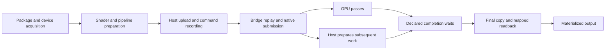

# Vulkan complete-operation investigation

## Disposition

Reject the native-addon optimization candidate. Rebuilding identical current
bridge source with `-O3` does not establish the required repeatable improvement
over the direct builder's default compilation. The baseline addon is restored;
production compiler, runtime, synchronization and subgroup policies are unchanged.

[Application comparison](application-comparison.json) retains every alternating
cohort, all provider lanes, latency percentiles, process memory and matched-pair
ratios. [Evaluation policy](evaluation-policy.json) was frozen before ordinary
cohorts. Favorable individual Doe/Dawn comparisons remain visible without being
promoted into a repeatable replacement advantage.

## Observed operation

The upstream application and shaders remain pinned and unchanged. The existing
workload times initialization through optimization, synchronization, mapped
readback and materialized output. Preparation is inside that operation; provider
loading and device acquisition also affect the separately measured fresh process.



[Operation timeline](operation-timeline.json) separates public recording calls,
pipeline construction, bridge replay, native submission, explicit completion
and final mapping. Driver submissions are joined to enclosing API calls using
the host monotonic clock. Those nested intervals cannot be added together.
Public observations show substantial synchronous submission time, but do not
prove how much of that time can be eliminated.

Dawn's shorter synchronous submission interval is accompanied by longer promise
settlement during completion. Moving a cost across those boundaries would not
qualify as an improvement. [GPU durations](gpu-durations.json) record the existing
timestamp probe separately: GPU timestamps have no calibrated host origin, so
they cannot be subtracted from unrelated CPU totals to manufacture a critical
path. The diagram describes dependencies and overlap, not calibrated GPU placement.

Native command-buffer allocation events are observed, but complete host malloc
attribution and compiler-cache miss counts remain incomplete. Initial versus
repeated calls are retained without inferring cache identity. Diagnostic snapshot
serialization and timestamp readback add overhead; ordinary acceptance cohorts
disable all such instrumentation.

## Correctness and compiler boundary

[Evidence](evidence.json) binds source, executables, hardware-bearing raw
receipts, toolchains and commands. Combined runtime and WGSL suites pass, as do
the candidate's public shader/render, consumed-command ownership, render lifetime
and selected Doppler kernel checks. Those checks do not establish full inference,
all malformed-input handling, recovery or complete WebGPU conformance.

[Compiler cost](compiler-cost.json) retains translation timing and backing
allocator observations separately from GPU execution. Fresh alternating samples
do not consistently reproduce the earlier apply-forces slowdown; the
[earlier compiler samples](../20261004-identifiers-subgroups/compiler-costs.json)
remain unresolved. Identifier admission is preserved. Hoisting and subgroup-width
rejections are not reopened.

## Reproduction and custody

```bash
node packages/doe-gpu/scripts/build-addon.js
DOE_WEBGPU_LIB=/path/to/retained/libwebgpu_doe.so \
  node bench/external-projects/umap-gpu/run-sgd-benchmark.mjs \
  --clean-process-runs 10 --run-id operation-baseline --require-all-pass
```

For the candidate, run the same builder with `CC` pointing to a wrapper that
executes `cc -O3 "$@"`. Restore the default build between baseline cohorts.
Use the declared baseline–candidate–candidate–baseline order and immutable input
hashes. Fresh processes used existing populated disk caches; these are not
empty-cache measurements. Diagnostic wrapper sources, native observer source,
raw timelines, compiler samples and failed observer-resolution logs are compressed
alongside successful runs. Executable custody is local and hash-bound, not a
portable installed-package or release qualification.

[Artifact index](artifact-index.json) authenticates retained payloads. Provider
binaries are not duplicated here.

## Next owned boundary

Separate binding preparation, native synchronization preparation and driver work
within ordinary submission before selecting the next correction. Driver time is
an observed interval, not proof of a compiler defect or an unnecessary wait.
Preserve completion ordering and pending-resource lifetimes. Vulkan remains the
active campaign; material application advantage is still open. Metal follows a
closed Vulkan campaign and D3D12 remains deferred.

Component: `doe.runtime.zig`, `doe.bench`, `doe.reports`, `doe.docs`, `doe.config`.

Intent: preserved.

Acceptance evidence: [evidence.json](evidence.json) and hash-bound adjacent artifacts.

Boundary effects: no production behavior change; source/workspace diagnostic
evidence and existing review scheduling are updated.
